## Manitoba master angler analysis

``` r
library(tidyverse)
library(lubridate)
library(scales)
library(tidytext)
```

``` r
ma_data <- read_csv("data/master_angler_data.csv")

ma_data <- ma_data %>%
  mutate(year = year(date),
         month = month(date, label = TRUE),
         address = str_to_title(address))
```

<br />

This analysis includes 414,635 Manitoba master angler records that I
scraped from the official website.

<br />

### How many trophy fish has the average master angler caught?

``` r
ma_counts <- ma_data %>% 
  group_by(first_name, last_name, address, inquirer_id) %>% 
  summarize(n_submissions = n()) %>%
  ungroup() 

ma_counts %>%
  filter(n_submissions < 25) %>%
  ggplot(aes(n_submissions)) + 
  geom_histogram(binwidth = 1) +
  labs(x = "Number of master angler submissions", 
       y = "Number of anglers",
       title = "Most master anglers have one submission",
       subtitle = "Note: Only anglers with 25 or less submissions are shown") +
  scale_x_continuous(label = comma_format()) +
  scale_y_continuous(label = comma_format())
```


``` r
ma_counts <- ma_counts %>%
  summarize(submissions_1 = mean(n_submissions == 1),
            submissions_5 = mean(n_submissions >= 5),
            submissions_10 = mean(n_submissions >= 10),
            submissions_100 = mean(n_submissions >= 100))
```

Over 50% (53.31%) of master anglers have only one trophy catch, 17.55%
have 5 or more trophy fish, 6.4% have 10 or more trophy fish, and only
0.21% have more than 100!

<br />

### How many trophy fish have been caught over time?

``` r
ma_data %>%
  filter(date >= "1960-01-01") %>%
  count(year = year(date)) %>%
  ggplot(aes(year, n)) + 
  geom_line() +
  scale_x_continuous(breaks = seq(1960, 2021, 5)) +
  labs(x = NULL,
       y = "Number of trophy fish caught",
       title = "The 2010s have seen the most trophy fish catches",
       subtitle = "Note: 2021 has incomplete data") +
  scale_y_continuous(label = comma_format())
```

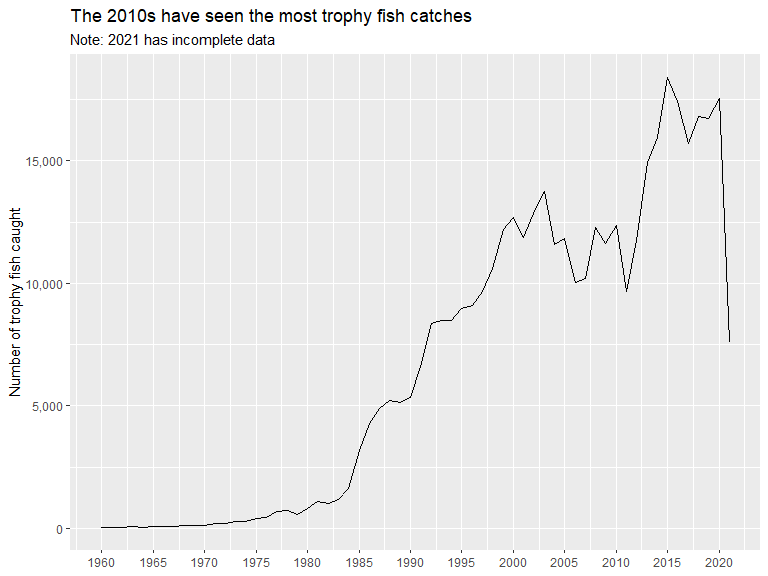

<br />

### How has the number of trophy fish caught changed over time (by species)?

``` r
ma_data %>%
  filter(species != "Kokanee") %>%
  filter(date >= "1960-01-01") %>%
  count(year = year(date), species) %>%
  ggplot(aes(year, n)) + 
  geom_line(size = 1.2) +
  scale_x_continuous(breaks = seq(1960, 2021, 20)) +
  labs(x = NULL,
       y = "Number of trophy fish caught",
       title = "The trends of master angler catches differs drasticaly between species",
       subtitle = "Note: 2021 has incomplete data") +
  facet_wrap(~species) +
  scale_y_continuous(label = comma_format())
```


<br />

### What trophy fish species have been caught the most?

``` r
ma_data %>%
  count(species) %>% 
  mutate(species = fct_reorder(species, n)) %>%
  ggplot(aes(n, species)) +
  geom_col() +
  labs(x = "Number of trophy fish caught",
       y = "Species",
       title = "Northern Pike, Walleye, and Catfish are the most frequently caught records") +
  scale_x_continuous(label = comma_format())
```

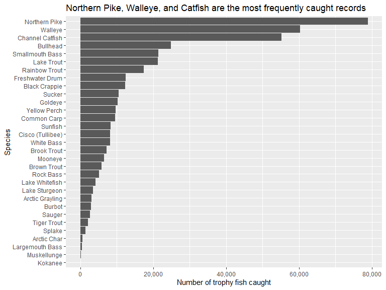

<br />

### What bodies of waters produce the most trophy fish?

``` r
ma_data %>%
  mutate(location = fct_lump(location, 50)) %>%
  filter(location != "Other") %>%
  count(location) %>%
  mutate(location = fct_reorder(location, n)) %>%
  ggplot(aes(n, location)) + 
  geom_col() +
  labs(x = "Number of trophy fish caught",
       y = NULL,
       title = "The Red River is by far the biggest master angler producer in Manitoba",
       subtitle = "Top 50 locations shown") +
  scale_x_continuous(labels = comma_format())
```


<br />

### What species are the top trophy fish waters producing?

``` r
ma_data %>%
  mutate(location = fct_lump(location, 9)) %>%
  filter(location != "Other") %>%
  count(location, species) %>%
  group_by(location) %>%
  slice_max(n = 5, n) %>%
  ungroup() %>%
  mutate(species = reorder_within(species, n, location)) %>% 
  ggplot(aes(n, species)) + 
  geom_col() +
  facet_wrap(~location, scales = "free") +
  scale_y_reordered() +
  scale_x_continuous(labels = comma_format()) +
  labs(x = "Number of trophy fish caught", 
       y = "Top 5 species", 
       title = "The top 5 species for the biggest trophy fish waters in Manitoba")
```

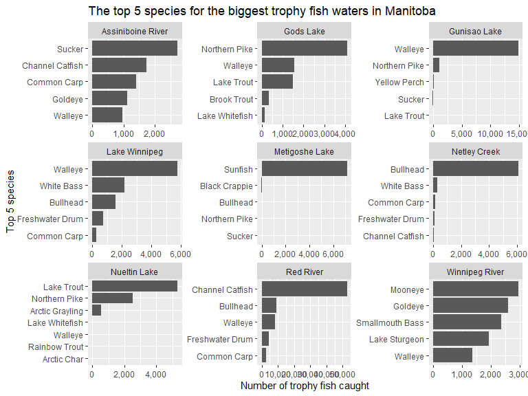

<br />

### Which waters produce the largest variety of trophy fish species?

``` r
ma_data %>%
  group_by(location) %>%
  summarize(n_unique_species = n_distinct(species)) %>%
  slice_max(n = 40, n_unique_species) %>%
  ungroup() %>%
  mutate(location = fct_reorder(location, n_unique_species)) %>%
  ggplot(aes(n_unique_species, location)) + 
  geom_col() +
  labs(x = "Number of unique species",
       y = NULL,
       title = "The Winnipeg River, Red River, and Lake Winnipeg have 20+ varieties of master angler species",
       subtitle = "Top 40 locations shown")
```

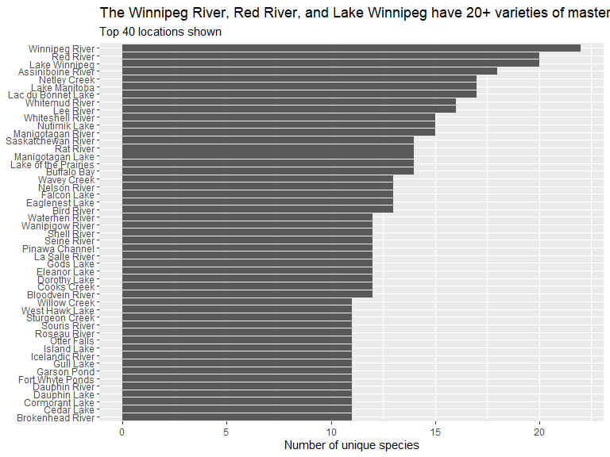

<br />

### How do trophy fish species vary in size?

``` r
ma_data %>%
  filter(length_in > 0) %>%
  mutate(species = fct_reorder(species, length_in)) %>%
  ggplot(aes(length_in, species)) +
  geom_boxplot() +
  labs(x = "Length in inches",
       y = NULL,
       title = "There are a lot of differences in size within and between species")
```

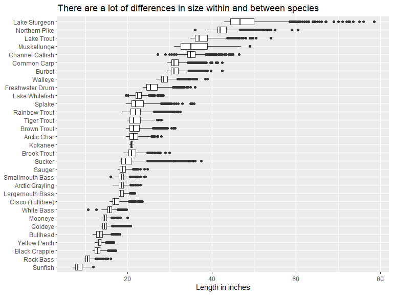

<br />

### How often are trophy fish released?

``` r
ma_data %>%
  count(released) %>%
  mutate(released = ifelse(released, "Released", "Not released")) %>%
  ggplot(aes(n, released)) +
  geom_col() +
  labs(x = "Count",
       y = NULL, 
       title = "Most trophy fish are released") +
  scale_x_continuous(label = comma_format())
```

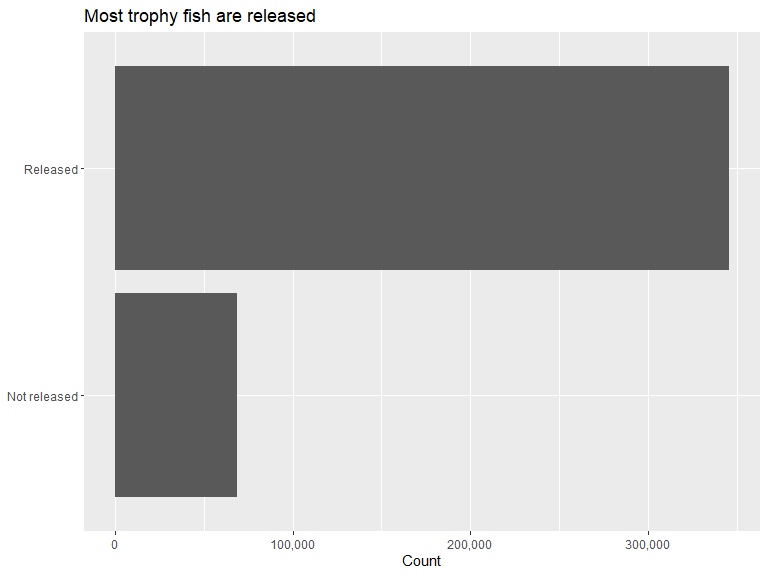

<br />

### How often are trophy fish released for each species?

``` r
ma_data %>%
  count(species, released)  %>%
  mutate(released = ifelse(released, "Released", "Not released")) %>%
  mutate(species = fct_reorder(species, n)) %>%
  ggplot(aes(n, species, fill = released)) +
  geom_col() +
  labs(x = "Number of trophy fish caught",
       y = NULL, 
       title = "Catch and release varies greatly between species") +
  scale_x_continuous(label = comma_format())
```

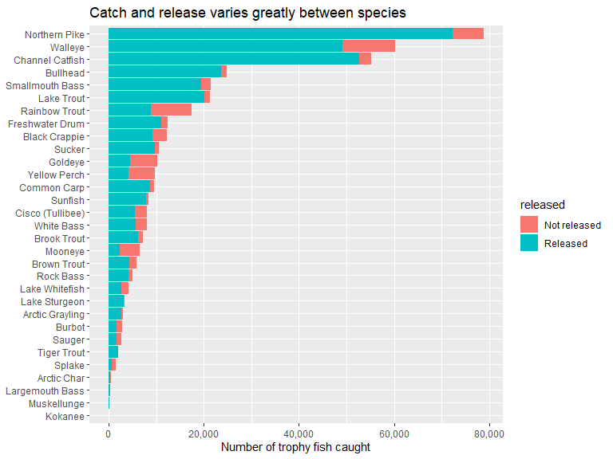

<br />

### Which species are released the most/least?

``` r
ma_data %>%
  group_by(species) %>%
  summarize(release_prop = sum(released) / n()) %>%
  ungroup() %>%
  mutate(species = fct_reorder(species, release_prop)) %>%
  ggplot(aes(release_prop, species)) + 
  geom_col() +
  labs(x = "Percent of fish released",
       y = NULL,
       title = "Catch and release varies greatly between species") +
  scale_x_continuous(labels = percent_format())
```

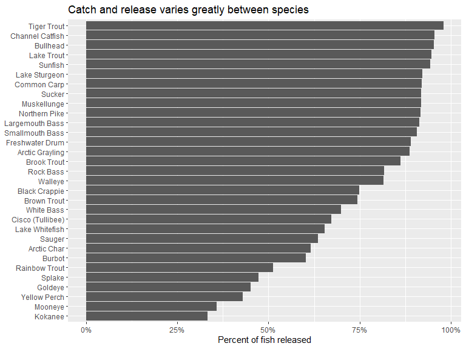

<br />

### How often are trophy fish catches photographed?

``` r
ma_data %>%
  count(has_photo) %>%
  mutate(has_photo = ifelse(has_photo, "Photographed", "Not photographed")) %>%
  ggplot(aes(n, has_photo)) +
  geom_col() +
  labs(x = "Number of trophy fish caught",
       y = NULL, 
       title = "Most trophy fish are camera shy") +
  scale_x_continuous(label = comma_format())
```

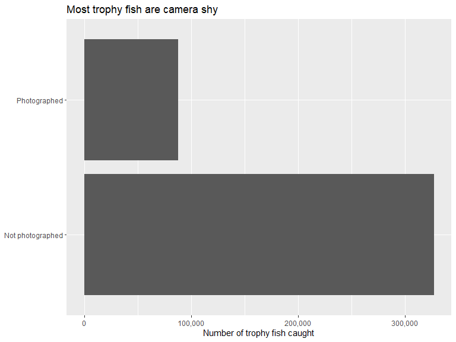

<br />

### Whch trophy fish species are photographed the most/least?

``` r
ma_data %>%
  group_by(species) %>%
  summarize(photo_prop = sum(has_photo) / n()) %>%
  ungroup() %>%
  mutate(species = fct_reorder(species, photo_prop)) %>%
  ggplot(aes(photo_prop, species)) + 
  geom_col() +
  labs(x = "Percent of fish photographed",
       y = NULL,
       title = "Including a photo submission varies greatly betwen species") +
  scale_x_continuous(labels = percent_format())
```

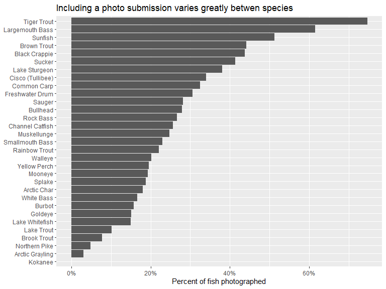

<br />

### How many trophy fish are caught be woman/men?

``` r
library(babynames)

names <- babynames %>% 
  filter(prop > 0.001) %>%
  distinct(name, sex) %>% 
  add_count(name) %>%
  mutate(sex = ifelse(n == 1, sex, "Androgynous")) %>% 
  distinct(name, sex) %>%
  rename(first_name = name)

ma_data <- ma_data %>%
  left_join(names) %>% 
  mutate(sex = ifelse(is.na(sex) | sex == "Androgynous", "Unknown", sex)) %>%
  mutate(sex = fct_recode(sex, "Male" = "M", "Female" = "F"))

ma_data %>%
  count(sex) %>%
  mutate(prop = n / sum(n)) %>%
  mutate(sex = fct_reorder(sex, prop)) %>%
  mutate(sex = fct_relevel(sex, "Unknown")) %>%
  ggplot(aes(prop, sex)) + 
  geom_col() +
  labs(x = "Percent of master angler submissions",
       y = NULL,
       title = "Most master anglers are men") +
  scale_x_continuous(labels = percent_format())
```


<br />

### How has the number of female anglers changed over time?

``` r
ma_data %>%
  filter(sex %in% c("Male", "Female")) %>%
  group_by(year = year(date)) %>%
  summarize(prop_female = sum(sex == "Female") / n()) %>%
  ungroup() %>% 
  ggplot(aes(year, prop_female)) + 
  geom_line() +
  scale_y_continuous(label = percent_format()) +
  scale_x_continuous(breaks = seq(1960, 2021, 10)) +
  labs(x = NULL,
       y = "Percent of female master anglers",
       title = "The number of female master anglers has increased over time") +
  expand_limits(y = .15)
```

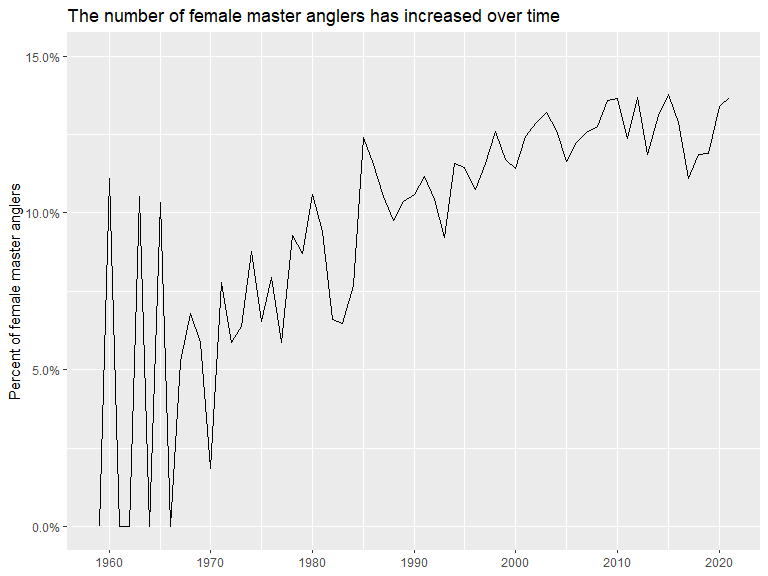

<br />

### What months are most trophy fish caught?

``` r
ma_data %>%
  mutate(month = month(date, label = TRUE)) %>% 
  count(month) %>%
  ggplot(aes(month, n)) + 
  geom_col() +
  labs(x = NULL, 
       y = "Number of trophy fish caught",
       title = "Most master anglers are caught in June") +
  scale_y_continuous(label = comma_format())
```

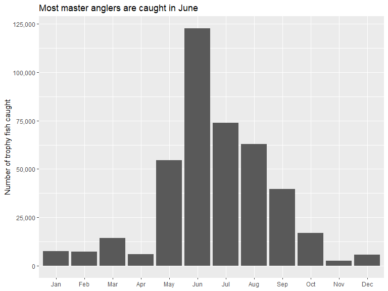

<br />

### What days of the week are most trophy fish caught?

``` r
ma_data %>%
  mutate(weekday = wday(date, label = TRUE)) %>% 
  count(weekday) %>%
  ggplot(aes(weekday, n)) + 
  geom_col() +
  labs(x = NULL, 
       y = "Number of trophy fish caught",
       title = "Most master anglers are caught in on the weekends") +
  scale_y_continuous(label = comma_format())
```

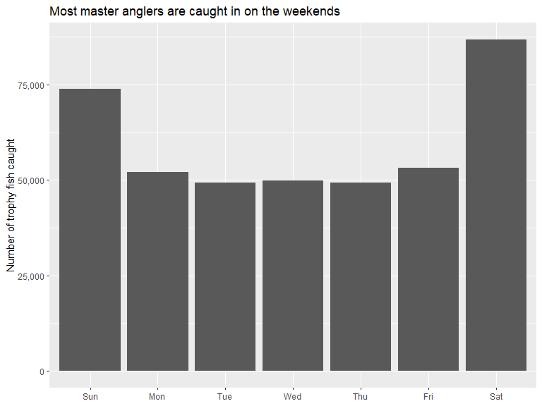

<br />

### What days of the week are most trophy fish caught?

``` r
ma_data %>%
  mutate(month = month(date, label = TRUE)) %>% 
  mutate(weekday = wday(date, label = TRUE)) %>% 
  count(month, weekday) %>%
  ggplot(aes(weekday, n)) + 
  geom_col() +
  labs(x = NULL, 
       y = "Number of trophy fish caught",
       title = "More master anglers are caught on the weekend",
       subtitle = "But this pattern is weaker during July and August") +
  scale_y_continuous(label = comma_format()) +
  facet_wrap(~month)
```

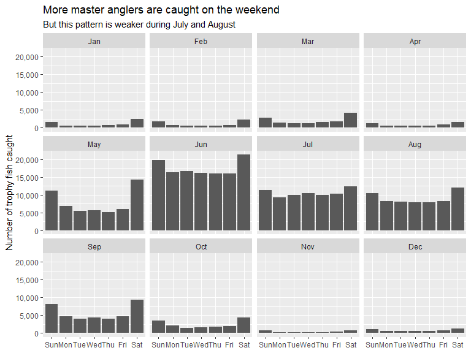

<br />

### What combination of lakes and months produce the most trophy fish?

``` r
ma_data %>% 
  mutate(month = month(date, label = TRUE)) %>% 
  mutate(season = case_when(
    month %in% c("Jan", "Feb", "Mar") ~ "Winter",
    month %in% c("Apr", "May") ~ "Spring",
    month %in% c("Jun", "Jul", "Aug") ~ "Summer",
    month %in% c("Sep", "Oct", "Nov", "dec") ~ "Winter"
  )) %>%
  count(location, season, species, sort = TRUE) %>% 
  mutate(label = paste(location, "in", season, "for", species)) %>%
  mutate(label = fct_reorder(label, n)) %>% 
  slice_max(n, n = 25) %>% 
  ggplot(aes(n, label)) + 
  geom_col() +
  labs(x = "Number of trophy fish caught",
       y = NULL,
       title = "Top locations/seasons/species") +
  scale_x_continuous(labels = comma_format(), breaks = seq(0, 40000, 5000))
```

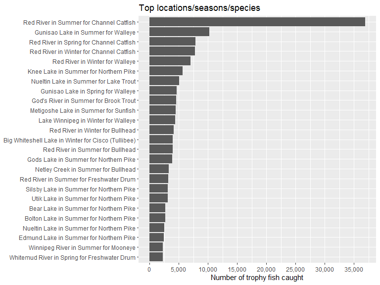

<br />

### Where are most anglers from?

``` r
ma_data %>% 
  mutate(local = ifelse(address == "Manitoba", "Manitoban", "Out of province")) %>%
  count(local) %>%
  mutate(local = fct_reorder(local, n)) %>%
  ggplot(aes(n, local)) + 
  geom_col() +
  labs(x = "Number of master angler submissions", 
       y = NULL,
       title = "Most anglers submitting master anglers are Manitobans") +
  scale_x_continuous(label = comma_format())
```


<br />

### Where are most out-of-province anglers from?

``` r
ma_data %>% 
  filter(address != "Manitoba") %>%
  mutate(address = str_to_title(address)) %>%
  mutate(address = fct_lump(address, 40)) %>% 
  count(address) %>% 
  mutate(address = fct_reorder(address, n)) %>% 
  ggplot(aes(n, address)) + 
  geom_col() +
  labs(x = "Number of master angler submissions",
       y = NULL,
       title = "Most out of province anglers are from Minnestoa, Illinois, and Wisconsin",
       subtitle = "Plot shows top 40 locations and an Other category") +
  scale_x_continuous(labels = comma_format())
```


<br />

### How many trophy fish are caught ice fishing?

``` r
ma_data %>%
  mutate(method = ifelse(ice_fishing, "Ice fishing", "Open water")) %>%
  count(method) %>%
  ggplot(aes(n, method)) +
  geom_col() +
  labs(x = "Number of master angler submissions",
       y = NULL, 
       title = "Most master anglers are caught in open water") +
  scale_x_continuous(label = comma_format())
```

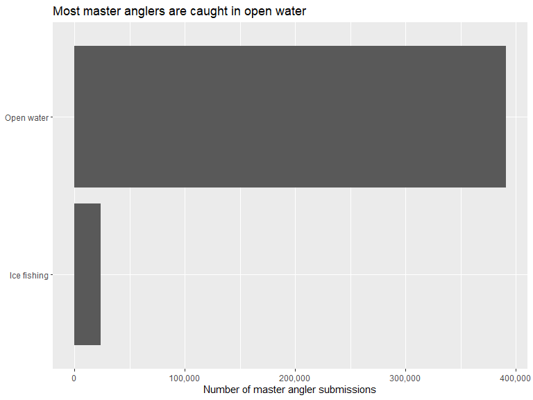

<br />

### Which trophy fish species are most often caught ice fishing?

``` r
ma_data %>%
  filter(ice_fishing) %>%
  count(species) %>%
  mutate(species = fct_reorder(species, n)) %>%
  ggplot(aes(n, species)) + 
  geom_col() +
  labs(x = "Number of trophy fish caught",
       y = NULL,
       title = "Most master anglers caught through the ice are walleye, cisco, and perch") +
  scale_x_continuous(label = comma_format())
```


<br />

### What combination of lakes and months produce the most trophy fish ice fishing?

``` r
ma_data %>% 
  filter(ice_fishing) %>% 
  mutate(month = month(date, label = TRUE, abbr = FALSE)) %>% 
  count(location, month, species, sort = TRUE) %>% 
  mutate(label = paste(location, "in", month, "for", species)) %>%
  mutate(label = fct_reorder(label, n)) %>% 
  slice_max(n, n = 25) %>% 
  ggplot(aes(n, label)) + 
  geom_col() +
  labs(x = "Number of trophy fish caught",
       y = NULL,
       title = "Top locations/seasons/species for ice fishing") +
  scale_x_continuous(labels = comma_format())
```


<br /> <br /> <br /> <br /> <br />
